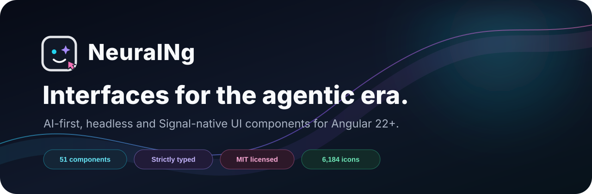

<div align="center">
  

  <br />

[](https://github.com/hasanaydin7/NeuralTech/actions/workflows/ci.yml)
[](https://www.npmjs.com/package/@neural-ng/core)
[](https://angular.dev/)
[](./LICENSE)

[Documentation](https://neuralng.dev) · [Installation](https://neuralng.dev/docs/installation) · [Components](https://neuralng.dev/docs/components) · [MCP server](https://neuralng.dev/docs/mcp-server) · [Contributing](./CONTRIBUTING.md)

</div>

NeuralNg is an AI-first Angular component system built for both human developers
and code-generating agents. It combines standalone, Signal-native APIs with
strict types, accessible native semantics, SSR-safe behavior, headless styling
and tree-shakable secondary entry points.

> **Beta:** the current Core release is `0.1.0-beta.6`. Public APIs may change
> before the first stable release.

## Why NeuralNg?

- **Agent-readable:** every public component ships focused README and `llms.txt`
  context, while the MCP server exposes component discovery and theme tools.
- **Angular-native:** standalone components, Signals, strict TypeScript, Angular
  Forms integration and deterministic hydration.
- **Accessible by contract:** native semantics, keyboard interaction, focus
  behavior and accessible names are part of component acceptance.
- **Style without lock-in:** use Neutral defaults, typed class slots, component
  tokens or complete `unstyled` control.
- **Package what you use:** import from dedicated secondary entry points for
  predictable, tree-shakable builds.

## Quick start

Install the component library and the framework-independent icon set:

```bash
npm install @neural-ng/core @neural-ng/icons
```

Load the icons and a bundled theme in your application styles:

```css
@import '@neural-ng/icons/icons.css';
@import '@neural-ng/core/themes/neutral.css';
```

Import only the component entry points you need:

```ts
import { Component } from '@angular/core';
import { NeuralButton } from '@neural-ng/core/button';
import { NeuralInput } from '@neural-ng/core/input';

@Component({
  selector: 'app-agent-form',
  imports: [NeuralButton, NeuralInput],
  template: `
    <label for="agent-task">Task</label>
    <input neuralInput id="agent-task" placeholder="Describe the task" />
    <neural-button label="Run agent" icon="nt nt-sparkles" />
  `,
})
export class AgentForm {}
```

See the [installation guide](https://neuralng.dev/docs/installation)
for application configuration, theming and SSR setup.

## Packages

| Package                                                                        | Purpose                                                             | Current release |
| ------------------------------------------------------------------------------ | ------------------------------------------------------------------- | --------------- |
| [`@neural-ng/core`](https://www.npmjs.com/package/@neural-ng/core)             | 51 accessible Angular components, services, localization and tokens | `0.1.0-beta.6`  |
| [`@neural-ng/editor`](https://www.npmjs.com/package/@neural-ng/editor)         | Structured, AI-native and collaboration-ready editor                | `0.1.0-beta.0`  |
| [`@neural-ng/icons`](https://www.npmjs.com/package/@neural-ng/icons)           | Framework-independent `nt nt-*` CSS mask icons                      | `0.1.0-beta.0`  |
| [`@neural-ng/theme`](https://www.npmjs.com/package/@neural-ng/theme)           | Typed theme recipe compiler and Tailwind v4 bridge                  | `0.1.0-beta.3`  |
| [`@neural-ng/mcp-server`](https://www.npmjs.com/package/@neural-ng/mcp-server) | Read-only component discovery and theme tooling for AI agents       | `0.1.0-beta.3`  |

## AI-agent workflow

NeuralNg keeps machine-readable context close to its public APIs. Agents can
read the hosted [`llms.txt`](https://neuralng.dev/llms.txt), consume the package
documentation beside each component, or connect the MCP server:

```bash
npx @neural-ng/mcp-server
```

The server supports bounded discovery and theme recipe operations without
granting write access to your application. See the
[MCP guide](https://neuralng.dev/docs/mcp-server) for client setup and
available resources.

## Theming

Neutral is the recommended stable source contract. `@neural-ng/theme` expands a
compact `neural.theme.json` recipe into Core and Editor CSS, a Tailwind v4
bridge, token interchange JSON and diagnostics:

```bash
npm install --save-dev @neural-ng/theme
npx neural-theme init
npx neural-theme build
```

Glass, Futuristic and Mist remain experimental presets while the theme system
is in beta. Use Neutral or `unstyled` for production-sensitive customization.

## Repository map

```text
apps/neural-site          Production documentation and landing application
apps/neural-site-e2e      Production-site Playwright coverage
apps/neural-demo          Component contract and regression laboratory
apps/neural-demo-e2e      Exhaustive interaction coverage
libs/neural-ng            @neural-ng/core source and component documentation
libs/neural-editor        @neural-ng/editor source
libs/neural-icons         @neural-ng/icons generator and assets
libs/neural-mcp           @neural-ng/mcp-server resources, tools and CLI
libs/neural-theme         Theme schema, token contract, compiler and CLI
templates/neural-starter  Angular + Tailwind consumer template
tools/neural-docs         Documentation contract and coverage verification
```

`neural-demo` is intentionally retained as a non-production regression
laboratory while its broader scenarios are migrated to `neural-site`. Public
documentation belongs in `neural-site`.

## Development

Use Node 24 and npm 11:

```bash
npm ci
npm run dev
```

Before opening a pull request, run the relevant quality gates:

```bash
npm run format:check
npm run lint
npm test
npm run build
npm run package:test
npm run docs:verify
npm run e2e:chromium
```

The package smoke test packs generated npm artifacts and compiles a minimal
external consumer. The MCP smoke test validates the published server over
stdio, and documentation verification checks package-to-route contracts,
installable examples and navigation coverage.

## Contributing

Issues, focused pull requests and documentation improvements are welcome. Read
[CONTRIBUTING.md](./CONTRIBUTING.md) before starting. Report vulnerabilities
privately through the process in [SECURITY.md](./SECURITY.md).

## Support the project

If NeuralNg saves you time, you can support its development by starring the
repository, sharing it, contributing fixes, or sponsoring ongoing work through
the **Sponsor** button at the top of the repository. GitHub Sponsors must be
activated for [`@hasanaydin7`](https://github.com/hasanaydin7) before monetary
contributions can be accepted.

## License

NeuralNg is released under the [MIT License](./LICENSE).
